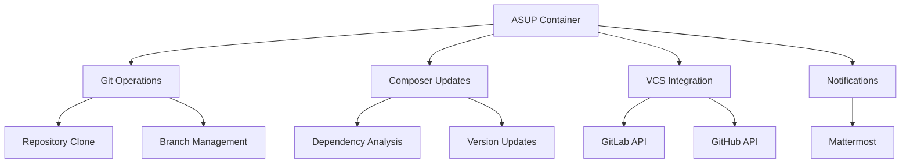
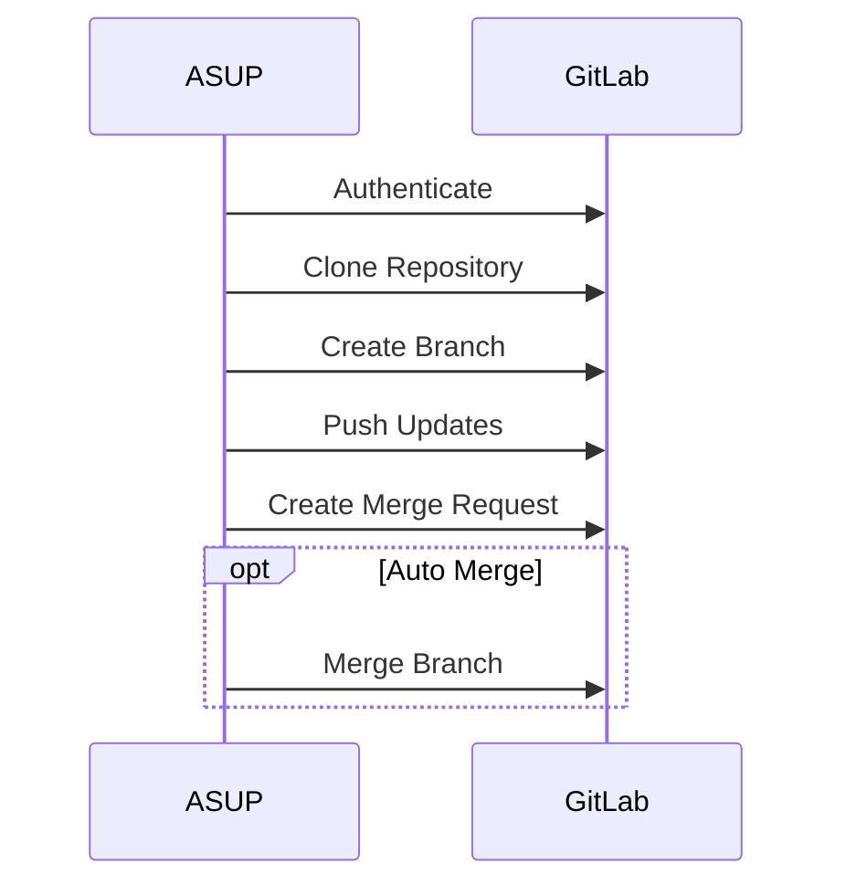
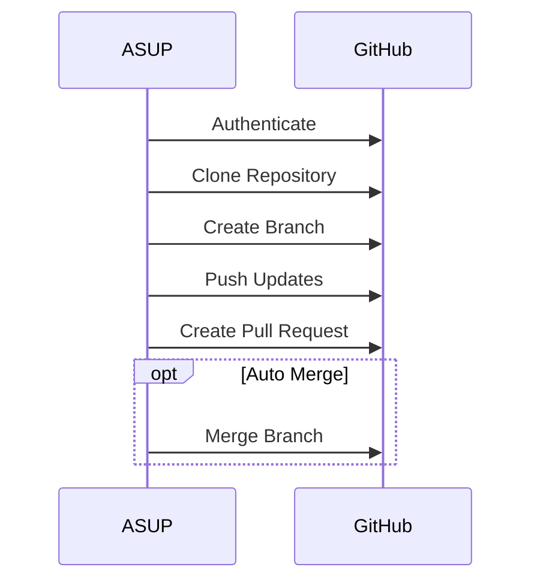
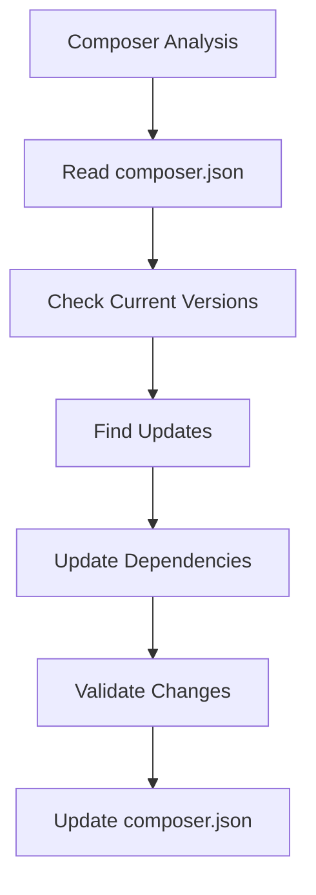
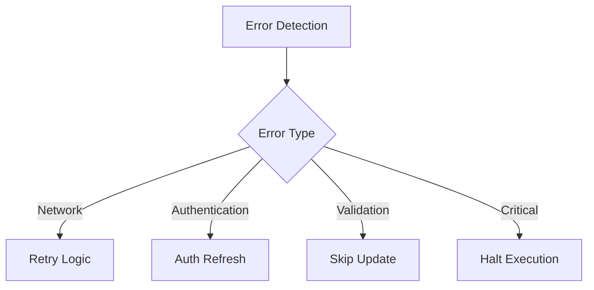
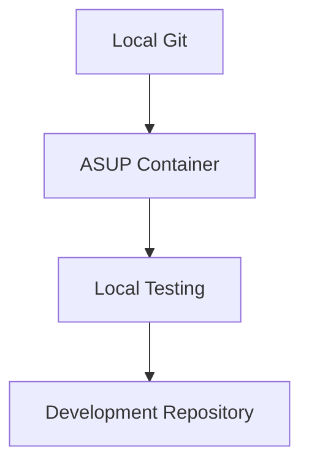
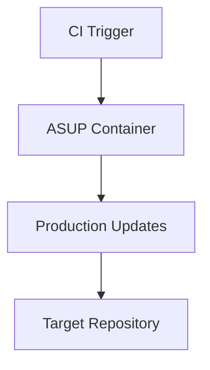

# ASUP Architecture

This document describes the architecture and design principles of ASUP.

## System Overview



## Core Components

### 1. Container Runtime

ASUP runs in a Docker container, providing:
- Isolated execution environment
- Consistent PHP runtime
- Dependency management
- Portable deployment

#### Container Structure
```
/
├── code/
│   ├── project/          # Cloned repository
│   ├── app/
│   │   ├── php/         # PHP integration scripts
│   │   └── sh/          # Shell scripts
│   └── api/             # API libraries
├── mount/
│   └── ssh/             # SSH keys
└── usr/local/bin/       # Entry points
```

### 2. Update Engine

The update process follows these steps:

1. **Repository Analysis**
   - Clone target repository
   - Analyze composer.json
   - Check current versions

2. **Update Detection**
   - Scan for outdated packages
   - Analyze security advisories
   - Check version constraints

3. **Update Application**
   - Create update branch
   - Apply dependency updates
   - Run composer update
   - Validate changes

4. **Change Management**
   - Create merge/pull request
   - Add change documentation
   - Optional auto-merge

## Integration Points

### 1. VCS Integration

#### GitLab Integration


#### GitHub Integration


### 2. Composer Integration



### 3. Notification System


## Security Architecture

### 1. Authentication

- Token-based authentication
- SSH key management
- Secure credential storage

### 2. Access Control

- Minimal required permissions
- Separate tokens per environment
- Automated key rotation

### 3. Data Protection

- Secure environment variables
- Protected configuration
- Encrypted communications

## Error Handling



## Performance Considerations

### 1. Resource Management

- Efficient git operations
- Composer cache optimization
- Parallel processing where possible

### 2. Rate Limiting

- API request throttling
- Batch processing
- Queue management

## Extensibility

### 1. Plugin Architecture

```
plugins/
├── vcs/              # VCS provider plugins
├── notifications/    # Notification plugins
└── validators/       # Update validators
```

### 2. Configuration Points

- Environment variables
- Provider configurations
- Update strategies

## Development Guidelines

### 1. Code Organization

```
src/
├── Core/            # Core functionality
├── VCS/            # VCS integrations
├── Composer/       # Composer operations
├── Notification/   # Notification system
└── Utils/          # Utility functions
```

### 2. Testing Strategy

- Unit tests for components
- Integration tests for workflows
- End-to-end testing

## Deployment Architecture

### 1. Local Development



### 2. CI/CD Integration



## Monitoring and Logging

### 1. Log Structure

- Operation logs
- Error tracking
- Performance metrics

### 2. Monitoring Points

- Update success rates
- API response times
- Error frequencies

## Future Considerations

### 1. Planned Improvements

- Additional VCS providers
- Enhanced notification options
- Advanced update strategies

### 2. Scalability Plans

- Multi-repository support
- Distributed processing
- Enhanced caching

## References

- [Configuration Guide](configuration.md)
- [API Documentation](api.md)
- [Contributing Guidelines](../CONTRIBUTING.md)