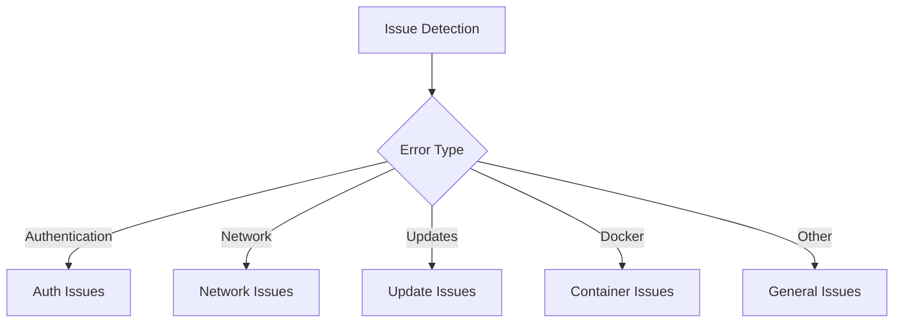

# Troubleshooting Guide

This guide helps you diagnose and resolve common issues with ASUP.

## Quick Diagnosis

Use this flowchart to identify your issue:



## Common Issues

### Authentication Issues

#### 1. Git Provider Authentication Failed

**Symptoms:**
- "Authentication failed" errors
- Permission denied messages
- Unable to clone repository

**Solutions:**
1. Verify token permissions:
   ```bash
   # Check token scopes
   curl -H "Authorization: Bearer YOUR_TOKEN" \
       https://api.github.com/user  # For GitHub
   ```

2. Validate SSH keys:
   ```bash
   # Test SSH connection
   ssh -T git@github.com  # For GitHub
   ssh -T git@gitlab.com  # For GitLab
   ```

3. Check environment variables:
   ```bash
   # Verify token is set
   echo $GIT_APERTA_TOKEN | wc -c  # Should be > 1
   ```

#### 2. SSH Key Issues

**Symptoms:**
- "Permission denied (publickey)"
- Unable to push changes
- SSH connection failures

**Solutions:**
1. Regenerate SSH keys:
   ```bash
   ./scripts/generate-ssh-keys.sh your-project
   ```

2. Verify key permissions:
   ```bash
   chmod 600 ssh/id_asup
   chmod 644 ssh/id_asup.pub
   ```

3. Add key to agent:
   ```bash
   eval "$(ssh-agent -s)"
   ssh-add ssh/id_asup
   ```

### Network Issues

#### 1. Unable to Reach Git Provider

**Symptoms:**
- Connection timeout errors
- DNS resolution failures
- SSL/TLS errors

**Solutions:**
1. Check connectivity:
   ```bash
   ping gitlab.example.com
   curl -v https://gitlab.example.com
   ```

2. Verify DNS:
   ```bash
   nslookup gitlab.example.com
   dig gitlab.example.com
   ```

3. Test SSL:
   ```bash
   openssl s_client -connect gitlab.example.com:443
   ```

#### 2. Proxy Issues

**Symptoms:**
- Slow connections
- Connection refused errors
- Intermittent failures

**Solutions:**
1. Configure proxy:
   ```env
   HTTP_PROXY=http://proxy.example.com:8080
   HTTPS_PROXY=http://proxy.example.com:8080
   NO_PROXY=localhost,127.0.0.1
   ```

### Update Issues

#### 1. Composer Update Failures

**Symptoms:**
- Dependency conflicts
- Version constraint errors
- Memory limit errors

**Solutions:**
1. Check composer.json:
   ```bash
   composer validate
   ```

2. Increase memory limit:
   ```env
   PHP_MEMORY_LIMIT=2G
   ```

3. Clear composer cache:
   ```bash
   composer clear-cache
   ```

#### 2. Merge Conflicts

**Symptoms:**
- Auto-merge failures
- Conflict messages in merge requests
- Unable to apply updates

**Solutions:**
1. Manual resolution:
   ```bash
   git checkout update-branch
   git merge target-branch
   # Resolve conflicts
   git commit
   ```

2. Reset and retry:
   ```bash
   git reset --hard origin/main
   # Re-run ASUP
   ```

### Container Issues

#### 1. Docker Build Failures

**Symptoms:**
- Build errors
- Missing dependencies
- Layer caching issues

**Solutions:**
1. Clean build:
   ```bash
   docker system prune -a
   ./build.local.sh
   ```

2. Check Docker daemon:
   ```bash
   docker info
   docker system df
   ```

#### 2. Runtime Issues

**Symptoms:**
- Container crashes
- Resource limitations
- Volume mount problems

**Solutions:**
1. Check logs:
   ```bash
   docker logs container_id
   ```

2. Verify resources:
   ```bash
   docker stats container_id
   ```

### General Issues

#### 1. Configuration Problems

**Symptoms:**
- Missing environment variables
- Invalid settings
- Unexpected behavior

**Solutions:**
1. Validate configuration:
   ```bash
   # Compare with example
   diff -u .env.example .env
   ```

2. Check permissions:
   ```bash
   ls -la .env
   ls -la ssh/
   ```

#### 2. Integration Issues

**Symptoms:**
- Notification failures
- API rate limiting
- Webhook errors

**Solutions:**
1. Test Mattermost:
   ```bash
   curl -X POST -H "Content-Type: application/json" \
       -d '{"text":"Test message"}' \
       $MATTERMOST_HOOK
   ```

2. Check API limits:
   ```bash
   # For GitHub
   curl -H "Authorization: Bearer $GIT_APERTA_TOKEN" \
       https://api.github.com/rate_limit
   ```

## Logging and Debugging

### Enable Debug Mode

```env
VERBOSE=1
DEBUG=1
```

### Check Logs

```bash
# Container logs
docker logs container_id

# Application logs
docker exec container_id cat /var/log/asup.log
```

### Generate Debug Report

```bash
./scripts/debug-report.sh
```

## Performance Issues

### Slow Updates

**Solutions:**
1. Enable composer parallel downloads:
   ```env
   COMPOSER_PARALLEL_DOWNLOADS=4
   ```

2. Use composer cache:
   ```env
   COMPOSER_CACHE_DIR=/cache
   ```

### Memory Usage

**Solutions:**
1. Adjust PHP memory:
   ```env
   PHP_MEMORY_LIMIT=2G
   ```

2. Monitor usage:
   ```bash
   docker stats container_id
   ```

## Getting Help

If you're still experiencing issues:

1. Check existing [Issues](https://github.com/your-org/asup/issues)
2. Search the [Documentation](index.md)
3. Create a new issue with:
   - Error messages
   - Configuration (sanitized)
   - Steps to reproduce
   - Environment details

## Preventive Measures

1. Regular maintenance:
   ```bash
   # Update ASUP
   git pull
   ./build.local.sh
   ```

2. Monitor disk space:
   ```bash
   docker system df
   df -h
   ```

3. Regular cleanup:
   ```bash
   docker system prune
   composer clear-cache